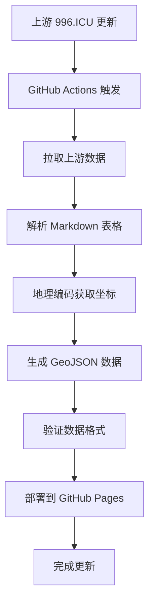

# 996.MAP - 可视化 996 工作制公司分布

[](https://996.icu/#/en_US)
[](LICENSE)
[](https://996icu.github.io/996.MAP)
[](https://github.com/996icu/996.MAP/actions)

## 🗺️ 项目简介

996.MAP 是基于 [996.ICU](https://github.com/996icu/996.ICU) 项目的可视化地图应用，将 Markdown 格式的公司黑名单转换为地理数据并在网页地图中展示。项目采用全自动数据管道，定期从上游拉取更新，通过纯 Markdown 解析、地理编码后生成地图数据。

**在线访问：** [https://996icu.github.io/996.MAP](https://996icu.github.io/996.MAP)

## 📊 数据概览

- **总计公司数量：** 200+ 家
- **覆盖城市：** 30+ 个
- **数据更新时间：** 2025-12-08
- **数据来源：** [996.ICU 黑名单](https://github.com/996icu/996.ICU/blob/master/blacklist/README.md)

## 🚀 功能特性

### ✅ 已实现功能

- **交互式地图展示：** 基于 Leaflet.js 的中国地图可视化
- **公司标记聚类：** 自动聚合相邻标记，提升性能
- **智能颜色编码：** 根据工作制度类型显示不同颜色
- **详细信息弹窗：** 点击标记查看公司详情和证据链接
- **自动化数据更新：** 每周自动从上游同步数据
- **地理编码缓存：** 避免重复 API 调用，提升效率

### 🎯 工作制度图例

- 🔴 **红色（#ff5252）：** 996/997/007 工作制
- 🟠 **橙色（#ffab40）：** 大小周工作制
- 🟡 **黄色（#ffd740）：** 995/10106 工作制
- ⚪ **灰色（#bdbdbd）：** 其他/不明确工作制

## 📁 项目架构

```
996.MAP/
├── .github/workflows/
│   └── data-pipeline.yml          # 自动化数据处理工作流
├── public/                        # GitHub Pages 部署目录
│   ├── index.html                 # 地图主页面
│   ├── companies.geojson          # 最终地图数据
│   └── assets/                    # 静态资源
├── scripts/                       # 数据处理脚本
│   ├── 1-parse-blacklist.py      # Markdown 解析
│   ├── 2-geocode.py              # 批量地理编码
│   └── 3-generate-geojson.py     # 生成 GeoJSON 格式
├── data/                          # 数据文件
│   ├── companies.json             # 解析后的公司数据
│   ├── companies-with-coords.json # 带坐标的公司数据
│   ├── geocache.json              # 地理编码缓存
│   └── archives/                  # 历史数据备份
├── config/
│   └── env.template              # 环境变量模板
└── README.md                     # 项目说明文档
```

## 🔧 技术栈

- **前端：** HTML5 + CSS3 + JavaScript (ES6+)
- **地图库：** Leaflet.js + Leaflet.markercluster
- **后端：** Python 3.9+
- **数据处理：** Python markdown 库 + 正则表达式
- **地理编码：** 高德地图 API
- **部署：** GitHub Actions + GitHub Pages
- **CI/CD：** GitHub Workflows

## 🛠️ 本地开发指南

### 环境要求

- Python 3.9+
- Git
- [uv](https://uv.oaix.tech/)（推荐）或 pip
- 高德地图 API 密钥（可选，用于地理编码）

### 快速开始

1. **克隆项目**

```bash
git clone https://github.com/996icu/996.MAP.git
cd 996.MAP
```

2. **使用 [uv](https://uv.oaix.tech/) 安装依赖（推荐）**

```bash
# 创建虚拟环境并安装依赖
uv sync
```

3. **配置环境变量**

```bash
cp config/env.template .env
# 编辑 .env 文件，添加高德地图 API 密钥
```

4. **运行数据处理脚本**

```bash
# 1. 解析 Markdown 黑名单
uv run scripts/1-parse-blacklist.py

# 2. 地理编码（需要 API 密钥）
uv run scripts/2-geocode.py

# 3. 生成 GeoJSON
uv run scripts/3-generate-geojson.py
```

5. **本地预览地图**

```bash
# 启动本地 HTTP 服务器
uv run python -m http.server 8000
# 访问 http://localhost:8000/public
```

### 环境变量配置

创建 `.env` 文件并配置以下变量：

```env
# 高德地图 API 密钥（必需）
GAODE_API_KEY=your_gaode_api_key_here

# 地理编码提供商（可选，默认：gaode）
GEOCODE_PROVIDER=gaode

# 批量请求数量（可选，默认：50）
GEOCODE_BATCH_SIZE=50
```

#### 获取高德地图 API 密钥

1. 访问 [高德开放平台](https://lbs.amap.com/)
2. 注册账号并创建应用
3. 获取 Web 服务 API 密钥
4. 确保已开通"地理编码"服务

## 📊 数据处理流程

### 自动化工作流



### 数据更新机制

- **定时更新：** 每周日凌晨 2 点 UTC 自动运行
- **手动更新：** 可通过 GitHub Actions 手动触发
- **增量更新：** 仅对新公司和变更公司进行地理编码
- **缓存机制：** 90 天内缓存地理编码结果

## 🔍 数据格式说明

### 输入数据（blacklist/README.md）

解析 996.ICU 项目中的 Markdown 表格，包含以下字段：

- 所在城市
- 公司名字（可能包含官网链接）
- 曝光/施行时间
- 制度描述
- 证据内容（链接和图片）

### 中间数据（companies.json）

```json
{
  "city": "北京",
  "company_name": "字节跳动",
  "company_url": "https://bytedance.com",
  "evidence_time": "2017年7月",
  "work_schedule": "996",
  "evidence_links": ["https://..."],
  "evidence_images": [],
  "raw_company_text": "[字节跳动](https://bytedance.com)"
}
```

### 最终数据（companies.geojson）

符合 GeoJSON RFC 7946 标准的 FeatureCollection，包含地理坐标和属性信息。

## 🚨 注意事项

### API 使用限制

- 高德地图 API 有每日调用次数限制
- 建议申请多个 API 密钥轮换使用
- 地理编码结果会缓存 90 天，避免重复调用

### 数据准确性

- 地理编码结果可能存在一定误差
- 部分公司可能无法获取精确坐标，会使用城市中心坐标
- 数据来源于社区贡献，准确性需要持续验证

### 隐私和合规

- 本项目仅展示公开信息
- 不收集任何用户个人信息
- 遵守相关法律法规

## 🤝 贡献指南

### 报告问题

- 在 [Issues](https://github.com/996icu/996.MAP/issues) 中报告 bug
- 提供详细的错误信息和复现步骤
- 附上相关日志文件（如存在）

### 提交改进

1. Fork 本项目
2. 创建功能分支 (`git checkout -b feature/amazing-feature`)
3. 提交变更 (`git commit -m 'Add some amazing feature'`)
4. 推送到分支 (`git push origin feature/amazing-feature`)
5. 创建 Pull Request

### 开发规范

- 遵循 Python PEP 8 编码规范
- 添加必要的代码注释
- 更新相关文档
- 确保所有测试通过

## 📈 项目状态

### 当前状态

- ✅ **MVP 版本已完成**
- ✅ **基础地图功能正常**
- ✅ **自动化数据管道运行正常**
- ✅ **GitHub Pages 部署成功**

### 已知问题

- 部分公司地理编码坐标存在偏差
- 地理编码 API 调用频率限制
- 需要优化大数据量下的地图性能

### 未来计划

- [ ] 添加搜索和筛选功能
- [ ] 实现热力图视图
- [ ] 支持时间轴动画
- [ ] 添加数据导出功能
- [ ] 优化移动端体验

## 📞 联系方式

- **项目维护：** GitHub Issues
- **数据问题：** [996.ICU 项目](https://github.com/996icu/996.ICU)
- **技术支持：** 在 Issues 中创建技术相关话题

## 📄 许可证

本项目采用 [Anti-996 License](LICENSE) 许可证，与 996.ICU 项目保持一致。

---

**免责声明：** 本项目旨在提高工作制度透明度，促进合理的工作时间安排。所有数据来源于公开信息，仅供参考。
